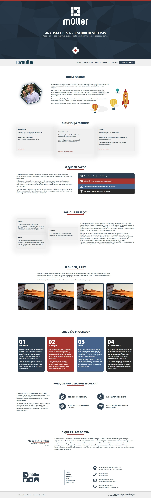

# **Site - Miguel Muller - Site Pessoal**

<table>
 <tr>
  <td><a href="https://github.com/miguelsmuller/site-pessoal/blob/main/README-en.md">Readme - English</a></td>
  <td><a href="https://github.com/miguelsmuller/site-pessoal/blob/main/README.md">Readme - Português</a></td>
 </tr>
</table>

## :pushpin: **Apresentação**

Em 2013 quando comecei a desenvolver como freelancer eu criei uma agência pessoal e a nomeie como “Devim”. Manter o nome Devim me afastada da minha xxx por que eu não conseguia dar atenção como eu queria a essa organismo vivo que era essa agência pessoal em virtude de outros compromissos profissionais.

Esse projeto é a versão reformulada do site só que agora com meu nome.

O projeto foi feito usando Next.JS, uma framework de React.js e utiliza TypeScript.

Esse projeto tem 2 propósitos:
1.	Ser o repositório do meu site pessoal.
2.	Servir de laboratório de experiências.

O projeto ainda não está completo. E nunca vai estar. Assim como é a minha visão de software. Ele atende as necessidades do agora. Mais as necessidades do amanhã podem ser outras.

 

## 	:link: **Ambientes**
Vou manter disponível esse projeto construído e 2 ambientes. O ambiente de produção possui o site estável e o ambiente de desenvolvimento possui novas features que estão sendo testadas.

Caso fique curioso você poderá ver o projeto nos links abaixo:

<table>
 <tr>
  <td><a href="#">Produção</a></td>
  <td><a href="#">Desenvolvimento</a></td>
 </tr>
</table>

 

## :computer: **Requerimentos e Instalação**
Os requiremos para execução local do projeto são simples.

É necessário ter o **[NodeJS](https://nodejs.org/)** e o **[NPM](https://www.npmjs.com/)** instalado em seu computador ou em uma máquina virtual.

`$ node --version && npm --version`

_Para referência foram no desenvolvimento NodeJS v16 e NPM v8_

 

Instale as **Dependências** do projeto com:
`$ npm install`

Execute o **Ambiente de Desenvolvimento** com o script NPM:
`$ npm run dev`

 

## :infinity: **Workflow**
**[WORKFLOW.md](WORKFLOW.md)** - This project uses the workflow pattern called `git flow`.
- [Atlassian - Comparing Workflows](https://www.atlassian.com/br/git/tutorials/comparing-workflows/gitflow-workflow)
- [Difference between workflows](https://www.zup.com.br/blog/git-workflow)
- [Girflow Cheatsheet](https://danielkummer.github.io/git-flow-cheatsheet/index.pt_BR.html)

 

## :1st_place_medal:	 **Tests**
[Precisa ser implementado]

 

## :rocket: **Deploy**
**[GITHUB ACTIONS](https://github.com/miguelsmuller/site-pessoal/actions/workflows/push-to-gh-pages.yml)** - To deploy to a demonstration of project hosted in GitHub Pages.

 

## :hammer_and_wrench: **Contributing**
**[CONTRIBUTING.md](CONTRIBUTING.md)** - Specifications of how the contribution should be submitted

 

## :memo: **Changelog**
**[CHANGELOG.md](CHANGELOG.md)** - Chronologically list of changes for each version of a project

 

## :framed_picture: **Screenshot**

