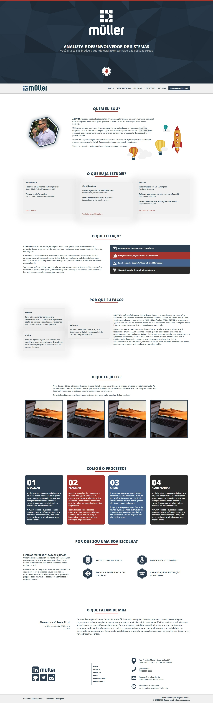

# **Site - Miguel Muller - Site Pessoal**

<table>
 <tr>
  <td><a href="docs/README-en.md"><strong>README.md - English</strong></a></td>
  <td><a href="README.md"><strong>README.md - Português</strong></a></td>
 </tr>
</table>

## :pushpin: **Apresentação**

Em 2010, quando iniciei minhas atividades como desenvolvedor freelancer, fundei minha agência pessoal chamada 'Devim'. Atualmente, manter o nome Devim me distancia do meu crescimento profissional, pois não é mais meu objetivo manter uma agência pessoal ou prosseguir com o desenvolvimento freelancer. Agora, busco consolidar minha carreira de forma contínua em ambientes corporativos.

Esse projeto é a versão reformulada do site só que agora com meu nome.

O projeto foi feito usando Next.JS, uma framework de React.js e utiliza TypeScript.

Esse projeto tem 2 propósitos:
1.	Ser o repositório do meu site pessoal.
2.	Servir de laboratório de experiências.

O projeto ainda não está completo. E nunca vai estar. Assim como é a minha visão de software. Ele atende as necessidades do agora. Mais as necessidades do amanhã podem ser outras.

 

## 	:file_cabinet: **Gerencimento de Conteúdo**

O projeto utiliza o Hygraph como a ferramenta principal para o gerenciamento de conteúdo. O Hygraph é uma poderosa plataforma de gerenciamento de conteúdo que oferece uma variedade de recursos e funcionalidades para facilitar a criação, organização e publicação de conteúdo de maneira eficiente e intuitiva.

**[Admin Content - Hygraph](https://app.hygraph.com/)**

### :arrow_forward: **Configuração do Hygraph**

Antes de executar o projeto, é necessário configurar o arquivo `graphcms.json` na pasta settings conforme o modelo `graphcms.json.exp` com as informações do seu projeto no Hygraph.

Estas informações são essenciais para que o projeto possa se conectar ao Hygraph e gerenciar o conteúdo de maneira eficiente.

 

## 	:link: **Ambientes**

Este projeto possui dois ambientes principais: Produção e Desenvolvimento.

- **Produção:** O ambiente de produção é onde o site estável está hospedado. Você pode acessá-lo aqui:

<table>
 <tr>
  <td><a href="https://www.miguelsmuller.dev.br">
    <strong>Live: www.miguelsmuller.dev.br</strong>
  </a></td>
 </tr>
</table>

- **Desenvolvimento:** O ambiente de desenvolvimento contém novas funcionalidades em teste. Quando ocorrem commits em branches que não sejam a principal (master), um ambiente de homologação é gerado automaticamente. Os links para esses ambientes de homologação são temporários e só estarão disponíveis após push na branch paralela.

 

## :computer: **Requerimentos e Instalação**
Os requerimentos para execução local do projeto são simples.

É necessário ter o **[NodeJS](https://nodejs.org/)** e o **[NPM](https://www.npmjs.com/)** instalado em seu computador ou em uma máquina virtual.

`$ node --version && npm --version`

_Para referência foram no desenvolvimento NodeJS v22 e NPM v9_

Instale as **Dependências** do projeto com:
`$ npm install`

Execute o **Ambiente de Desenvolvimento** com o script NPM:
`$ npm run dev`

 

## :gear: **Workflow**
**[WORKFLOW.md](./docs/WORKFLOW.md)** - Este projeto utiliza o padrão de fluxo de trabalho chamado `git flow`.

- [Atlassian - Comparando Fluxos de Trabalho](https://www.atlassian.com/br/git/tutorials/comparing-workflows/gitflow-workflow)
- [Diferenças entre Fluxos de Trabalho](https://www.zup.com.br/blog/git-workflow)
- [Gitflow Cheatsheet](https://danielkummer.github.io/git-flow-cheatsheet/index.pt_BR.html)

 

## :1st_place_medal: **Tests**
[Precisa ser implementado]

 

## :rocket: **Deploy**
**[GITHUB ACTIONS](https://github.com/miguelsmuller/site-miguelsmuller/actions)** - Este projeto utiliza duas workflows do GitHub Actions para implantação:

- **Deploy to Live ([firebase-hosting-master.yml](./.github/workflows/firebase-hosting-master.yml)):** Esta workflow é acionada automaticamente em commits na branch principal (master) e é responsável por implantar a versão estável do site no ambiente de produção.
  - Você pode acompanhar o progresso dessa workflow [aqui](https://github.com/miguelsmuller/site-miguelsmuller/actions/workflows/firebase-hosting-master.yml).

- **Deploy to Preview ([firebase-hosting-channel.yml](./.github/workflows/firebase-hosting-channel.yml)):** Esta workflow é acionada automaticamente em commits em branches que não sejam a principal (master) e é responsável por criar um ambiente de pré-visualização (preview) para testar novas funcionalidades. Os links para esses ambientes de pré-visualização são gerados de forma aleatória e temporária.
  - Você pode acompanhar o progresso dessa workflow [aqui](https://github.com/miguelsmuller/site-miguelsmuller/actions/workflows/firebase-hosting-channel.yml).

### :fire: **Firebase Functions**

Este projeto utiliza o Firebase Functions para hospedagem, e o arquivo `server.js` na raiz do projeto é o ponto de entrada (entrypoint) para as funções do Firebase. O método principal, `nextjsServer`, é responsável por iniciar o servidor Next.js.

### Configuração do Package.json

Certifique-se de que o arquivo `package.json` está configurado corretamente, apontando para o arquivo `server.js` como o ponto de entrada principal das funções Firebase.

 

## :hammer_and_wrench: **Contributing**
**[CONTRIBUTING.md](./docs/CONTRIBUTING.md)** - Especificações de como a contribuição deve ser enviada

 

## :memo: **Changelog**
**[CHANGELOG.md](./docs/CHANGELOG.md)** - Lista cronológica de alterações para cada versão do projeto

 

## :framed_picture: **Screenshot**

