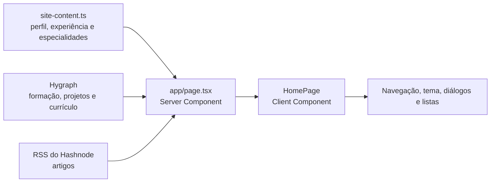
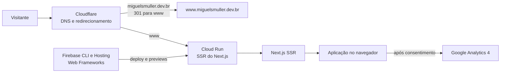

# Miguel Müller — site pessoal


<table>
 <tr>
  <td><a href="docs/README-en.md"><strong>README.md - English</strong></a></td>
  <td><a href="README.md"><strong>README.md - Português</strong></a></td>
 </tr>
</table>

Em 2010, quando iniciei minhas atividades como desenvolvedor freelancer, fundei minha agência pessoal chamada 'Devim'. Atualmente, manter o nome Devim me distancia do meu crescimento profissional, pois não é mais meu objetivo manter uma agência pessoal ou prosseguir com o desenvolvimento freelancer. Agora, busco consolidar minha carreira de forma contínua em ambientes corporativos. A homepage apresenta perfil, especialidades, experiência, formação, artigos e projetos em uma interface editorial, responsiva e acessível.

Esse projeto tem 2 propósitos:
1.	Ser o repositório do meu site pessoal.
2.	Servir de laboratório de experiências.

O projeto ainda não está completo. E nunca vai estar. Assim como é a minha visão de software. Ele atende as necessidades do agora. Mais as necessidades do amanhã podem ser outras.

## Início rápido

Com Node.js 22 e npm instalados, execute:

```bash
npm ci
npm run dev
```

Abra `http://localhost:3000`. O site funciona sem credenciais locais; nesse caso, apenas formação e projetos são exibidos como indisponíveis. Para carregar esse conteúdo, crie um arquivo `.env.local` com `HYGRAPH_URL` e `HYGRAPH_KEY`, conforme a seção [Gerenciamento de conteúdo](#gerenciamento-de-conteúdo).

## Visão geral

O projeto usa [Next.js](https://nextjs.org/), React e TypeScript. Ele separa o conteúdo da apresentação: dados estáveis ficam no repositório, enquanto formações, projetos, currículo e artigos vêm de fontes remotas.


```mermaid
flowchart LR
  Local[site-content.ts\nperfil, experiência e especialidades] --> Page[app/page.tsx\nServer Component]
  Hygraph[Hygraph\nformação, projetos e currículo] --> Page
  Hashnode[RSS do Hashnode\nartigos] --> Page
  Page --> Home[HomePage\nClient Component]
  Home --> UI[Navegação, tema, diálogos e listas]
```

`app/page.tsx` é renderizado dinamicamente a cada requisição. Ele busca Hashnode e Hygraph no servidor em paralelo e passa os dados normalizados para `HomePage`. O navegador não chama essas fontes de conteúdo diretamente.

### Infraestrutura de entrega

O deploy usa uma arquitetura híbrida entre Firebase, Google Cloud e Cloudflare. O Firebase CLI e o Firebase Hosting com Web Frameworks são a porta de deploy e de previews, mas o SSR do Next.js é atendido por um serviço gerenciado no Cloud Run.

Os domínios `miguelsmuller.dev.br` e `www.miguelsmuller.dev.br` possuem mapeamentos no Cloud Run para esse mesmo serviço. A Cloudflare é a zona DNS autoritativa e aplica o redirecionamento permanente do domínio raiz para `www`. Portanto, no acesso normal, a requisição para o domínio sem `www` é redirecionada na Cloudflare antes de chegar ao Cloud Run.

### Configuração de produção

| Camada | Configuração atual | Papel no acesso público |
| --- | --- | --- |
| Firebase | Projeto `miguelmuller-site`; `firebase.json` usa `frameworksBackend`. | Recebe os deploys e previews pela integração Web Frameworks. |
| Cloud Run | Serviço gerenciado para o site. | Executa o SSR e entrega a aplicação Next.js. |
| Domínios no Google Cloud | `miguelsmuller.dev.br` e `www.miguelsmuller.dev.br` mapeados para o mesmo serviço. | Permite que os dois hosts cheguem ao mesmo serviço. |
| Cloudflare | DNS autoritativo; raiz proxyada; regra `301` de `miguelsmuller.dev.br` para `www.miguelsmuller.dev.br`. | Define o host canônico e preserva caminho e query no redirecionamento. |


```mermaid
flowchart LR
  Visitor[Visitante] --> CF[Cloudflare\nDNS e redirecionamento]
  CF -->|miguelsmuller.dev.br\n301 para www| WWW[www.miguelsmuller.dev.br]
  CF -->|www| Run[Cloud Run\nSSR do Next.js]
  Firebase[Firebase CLI e Hosting\nWeb Frameworks] -->|deploy e previews| Run
  Run --> App[Next.js SSR]
  App --> Browser[Aplicação no navegador]
  Browser -->|após consentimento| GA[Google Analytics 4]
```

## Arquitetura e responsabilidades

| Área | Local | Responsabilidade |
| --- | --- | --- |
| Página e composição | `app/page.tsx` | Busca os dados remotos, combina-os ao conteúdo local e define os metadados da página. |
| Conteúdo local | `app/data/site-content.ts` | Perfil, links, especialidades e experiências profissionais. |
| Conteúdo do Hygraph | `app/data/hygraph-content.ts` | Consulta e normaliza formação, cursos, certificações, projetos e URL do currículo. |
| Artigos | `app/data/hashnode-articles.ts` | Lê e normaliza o RSS público do Hashnode. |
| Interface | `app/components/home-page.tsx` e `app/components/home/` | Organiza as seções, navegação, diálogos, tema e comportamento responsivo. |
| Estilos | `app/components/home-page.module.css` e `app/globals.css` | Define o visual da homepage e os tokens globais de tema. |
| Descoberta | `app/layout.tsx`, `app/robots.ts` e `app/sitemap.ts` | Fornece metadados, Open Graph, Twitter Card, `robots.txt` e `sitemap.xml`. |

### Interface e acessibilidade

A homepage tem índice lateral em telas maiores e drawer de navegação em dispositivos móveis. A seção visível atual é indicada pelo `IntersectionObserver`; o tema é administrado por `next-themes` e respeita a preferência do sistema por padrão.

Os diálogos de contato e projeto usam portal, fecham com `Escape`, preservam o foco dentro da interface e devolvem o foco ao elemento que os abriu. Há também um atalho para pular diretamente ao conteúdo principal. As listas de artigos, cursos e projetos usam paginação progressiva sem remover o acesso a “ver todos”.

## Direção visual

A homepage segue uma estética editorial e textual, inspirada em HTML cru/browser default refinado. A intenção é parecer um documento web profissional, simples e direto, mas com acabamento de produto: bom espaçamento, hierarquia tipográfica clara, navegação acessível e interações discretas.

A interface evita padrões visuais de landing pages modernas, como heroes grandes, cards decorativos, gradientes, sombras fortes e imagens de destaque em artigos ou projetos. O refinamento visual deve vir principalmente de grid, tipografia, espaçamento, alinhamento, contraste e estados de interação.

### Princípios

- Priorizar leitura e escaneabilidade.
- Manter a estrutura próxima de um índice/documento técnico.
- Usar cores apenas com função semântica ou de navegação.
- Usar ícones pequenos e funcionais, sem excesso decorativo.
- Manter artigos e projetos sem imagens de destaque.
- Usar modais simples e acessíveis para contato e detalhes de projetos.
- Preservar consistência entre modo claro e modo escuro.

### Manutenção visual

Ao alterar a interface, evite introduzir componentes com aparência de template SaaS, cards decorativos, sombras fortes, gradientes ou animações chamativas.

Novas seções devem seguir o mesmo ritmo editorial da página atual: título claro, conteúdo textual, espaçamento consistente e separação por respiro visual. As seções principais não devem usar `border-top`; o separador horizontal deve permanecer restrito ao footer ou a divisões internas pontuais.

## Gerenciamento de conteúdo

| Conteúdo | Fonte | Como atualizar |
| --- | --- | --- |
| Perfil, redes, especialidades e experiência | `app/data/site-content.ts` | Edite os dados tipados nesse arquivo. |
| Formação, cursos, certificações, projetos e currículo | Hygraph, estágio `PUBLISHED` | Publique a alteração no Hygraph. A próxima requisição refletirá o conteúdo. |
| Artigos | `https://articles.miguelsmuller.dev.br/rss.xml` | Publique no Hashnode; o feed público é lido a cada requisição. |

O Hashnode não requer token ou variável de ambiente. Para o Hygraph, a aplicação precisa das variáveis abaixo:

```bash
# .env.local (não versionado)
HYGRAPH_URL=https://<seu-endpoint>.hygraph.com/v2/<projeto>/master
HYGRAPH_KEY=<token-de-leitura>
```

Nunca versione credenciais. Em GitHub Actions, `HYGRAPH_URL` e `HYGRAPH_KEY` devem existir como secrets do repositório.

Se o RSS estiver indisponível, a seção de artigos mostra uma mensagem temporária de indisponibilidade. Se o Hygraph não responder, apenas as seções de formação e projetos exibem esse estado; os dados locais e o restante da página continuam disponíveis.

## Configuração local

- Node.js 22
- npm

O procedimento de primeira execução está em [Início rápido](#início-rápido). Para desenvolver com formação e projetos, configure o Hygraph conforme [Gerenciamento de conteúdo](#gerenciamento-de-conteúdo).

Para validar a versão de produção localmente:

```bash
npm run build
npm run start
```

## Métricas e consentimento

O site usa a conta GA4 `Pessoal` (`xxxxx900`) e a propriedade `miguelmuller-site` (`xxxxxx730`). O fluxo Web `Site pessoal – produção` tem URL padrão `https://www.miguelsmuller.dev.br`; seu ID de medição público está declarado em `app/lib/analytics.ts`.

O código usa o ID de medição (`G-…`), não o ID numérico da propriedade. O GA4 mantém o vínculo entre esse ID, o fluxo e a propriedade `xxxxxx730`.

No primeiro acesso, o visitante pode aceitar ou recusar o uso do Google Analytics. A escolha é salva somente no `localStorage` do navegador. A tag é inserida apenas após o aceite e somente em `www.miguelsmuller.dev.br`; ambientes locais e canais de preview não enviam dados à propriedade. O domínio sem `www` é redirecionado permanentemente pela Cloudflare antes de a aplicação carregar, por isso também chega ao endereço canônico e à mesma medição. O fluxo usa a Medição avançada padrão do GA4 para visualizações de página, rolagens, cliques de saída e demais eventos automáticos compatíveis.

O GA4 é executado no navegador. Firebase Hosting, Cloud Run e os mapeamentos de domínio não enviam eventos de Analytics por conta própria; eles influenciam a coleta apenas ao entregar a aplicação e ao garantir que o visitante chegue ao host canônico `www`.

O caminho de dados é: visitante aceita o banner → o navegador inicializa `gtag.js` → o navegador envia eventos diretamente ao GA4. Nenhum evento passa pelo Firebase, Cloud Run ou Cloudflare depois que a página foi entregue.

### Validação após deploy

1. Em uma janela anônima, acesse `https://miguelsmuller.dev.br` e confirme o redirecionamento para `https://www.miguelsmuller.dev.br`.
2. Aceite o banner de Analytics e navegue pelo site.
3. Consulte o relatório em tempo real da propriedade `xxxxxx730` imediatamente. Ele mostra apenas os últimos 30 minutos.
4. Consulte os relatórios padrão mais tarde: os dados processados podem levar algumas horas para aparecer.
5. Em outra janela anônima, recuse o banner e confirme que não há carregamento de `gtag.js` nem requisições de Analytics.

Além dos eventos automáticos, o site registra os eventos personalizados abaixo. Os parâmetros são técnicos e não contêm dados pessoais.

| Evento | Quando ocorre | Parâmetros |
| --- | --- | --- |
| `section_view` | Uma seção passa a ser vista pela primeira vez na visita. | `section_name` |
| `contact_open` | A pessoa abre o diálogo de contato. | `contact_source` |
| `contact_link_click` | A pessoa seleciona um canal de contato ou currículo. | `contact_method`, `contact_source` |
| `project_view` | A pessoa abre os detalhes de um projeto. | `project_slug` |
| `project_link_click` | A pessoa segue um link dentro do diálogo do projeto. | `project_slug`, `project_link_label` |
| `article_click` | A pessoa abre um artigo. | `article_category` |
| `learning_filter` | A pessoa filtra cursos e certificações. | `learning_filter` |
| `content_list_action` | A pessoa expande ou recolhe uma lista. | `content_section`, `content_action` |

### Scripts disponíveis

| Comando | Finalidade |
| --- | --- |
| `npm run dev` | Inicia o Next.js em desenvolvimento. |
| `npm run build` | Gera o build de produção em `nextjs/`. |
| `npm run start` | Inicia o build de produção. |
| `npm run lint` | Executa a checagem de lint configurada pelo Next.js. |
| `npm run test:e2e` | Executa os testes end-to-end com Playwright e axe. |
| `npm run serve` | Gera o build e inicia o emulador do Firebase Hosting. |
| `npm run deploy` | Publica no Firebase Hosting. |

## Testes

Os testes end-to-end ficam em `tests/e2e/professional-site.spec.ts`. Eles executam em Chromium e verificam, entre outros pontos:

- estrutura editorial e regras WCAG 2 A/AA com axe;
- diálogo de contato, foco e fechamento por `Escape`;
- filtros e paginação de formação, artigos e projetos;
- drawer de navegação em mobile e retorno ao topo.

Execute-os com:

```bash
npm run test:e2e
```

O Playwright inicia `npm run dev` automaticamente quando necessário. Os relatórios e resultados locais são ignorados pelo Git.

## Ambientes e deploy

- **Produção:** [www.miguelsmuller.dev.br](https://www.miguelsmuller.dev.br), atualizada por push na branch `master`.
- **Preview:** cada push em uma branch diferente de `master` cria um canal temporário do Firebase Hosting.

As workflows estão em `.github/workflows/`:

- `firebase-hosting-master.yml` instala as dependências, gera o build e publica a produção;
- `firebase-hosting-channel.yml` gera e publica o preview após a validação do build.

Ambas usam Node.js 20, secrets do Hygraph e Firebase Hosting com Web Frameworks. Essa integração publica o SSR do Next.js no Cloud Run; ela não transforma a infraestrutura em Firebase Hosting puro. Os mapeamentos de domínio personalizados são mantidos no Cloud Run, enquanto a Cloudflare mantém o DNS e o redirecionamento canônico. O acompanhamento dos deploys está disponível em [GitHub Actions](https://github.com/miguelsmuller/site-miguelsmuller/actions).

## Documentos relacionados

- [Guia de contribuição](docs/CONTRIBUTING.md)
- [Workflow de Git](docs/WORKFLOW.md)
- [Changelog](docs/CHANGELOG.md)
