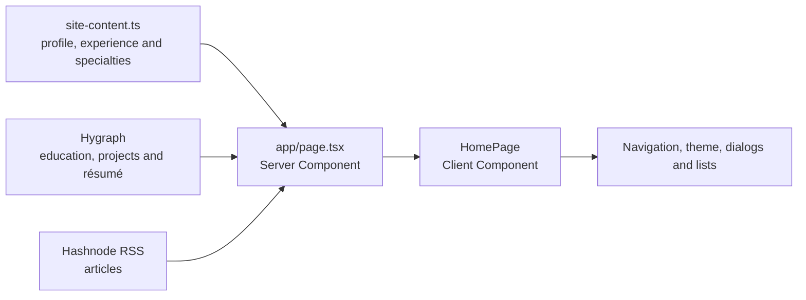

# Miguel Müller — personal website


<table>
 <tr>
  <td><a href="README-en.md"><strong>README.md - English</strong></a></td>
  <td><a href="../README.md"><strong>README.md - Portuguese</strong></a></td>
 </tr>
</table>

In 2010, when I began working as a freelance developer, I founded my personal agency, Devim. Today, retaining the Devim name no longer reflects my professional growth: my goal is no longer to run a personal agency or continue as a freelancer. I am now focused on steadily building my career in corporate environments. The homepage presents my profile, specialties, experience, education, articles, and projects through an editorial, responsive, and accessible interface.

This project serves two purposes:

1. To be the repository for my personal website.
2. To act as an experimental lab.

The project is not complete, and it never will be. This reflects my view of software: it meets today's needs, while tomorrow may bring different ones.

## Quick start

With Node.js 22 and npm installed, run:

```bash
npm ci
npm run dev
```

Open `http://localhost:3000`. The site works without local credentials; in that case, only the education and project sections show as unavailable. To load that content, create a `.env.local` file with `HYGRAPH_URL` and `HYGRAPH_KEY`, as described in [Content management](#content-management).

## Overview

The project uses [Next.js](https://nextjs.org/), React, and TypeScript. It keeps content separate from presentation: stable data lives in the repository, while education, projects, résumé, and articles come from remote sources.


```mermaid
flowchart LR
  Local[site-content.ts\nprofile, experience and specialties] --> Page[app/page.tsx\nServer Component]
  Hygraph[Hygraph\neducation, projects and résumé] --> Page
  Hashnode[Hashnode RSS\narticles] --> Page
  Page --> Home[HomePage\nClient Component]
  Home --> UI[Navigation, theme, dialogs and lists]
```

`app/page.tsx` is dynamically rendered on every request. It fetches Hashnode and Hygraph concurrently on the server and passes normalized data to `HomePage`. The browser does not call those content sources directly.

## Architecture and responsibilities

| Area | Location | Responsibility |
| --- | --- | --- |
| Page and composition | `app/page.tsx` | Fetches remote data, merges it with local content, and defines page metadata. |
| Local content | `app/data/site-content.ts` | Profile, links, specialties, and professional experience. |
| Hygraph content | `app/data/hygraph-content.ts` | Queries and normalizes education, courses, certifications, projects, and the résumé URL. |
| Articles | `app/data/hashnode-articles.ts` | Reads and normalizes the public Hashnode RSS feed. |
| Interface | `app/components/home-page.tsx` and `app/components/home/` | Organizes sections, navigation, dialogs, theme, and responsive behavior. |
| Styles | `app/components/home-page.module.css` and `app/globals.css` | Defines homepage visuals and global theme tokens. |
| Discoverability | `app/layout.tsx`, `app/robots.ts`, and `app/sitemap.ts` | Provides metadata, Open Graph, Twitter Card, `robots.txt`, and `sitemap.xml`. |

### Interface and accessibility

The homepage has a sidebar index on larger screens and a navigation drawer on mobile. The currently visible section is tracked with `IntersectionObserver`; `next-themes` manages the color theme and follows the system preference by default.

The contact and project dialogs use portals, close with `Escape`, keep focus within the active interface, and restore focus to their trigger. A skip link takes keyboard users directly to the main content. Article, course, and project lists use progressive pagination while retaining a “show all” option.

## Visual Direction

The homepage follows an editorial, text-first aesthetic inspired by raw HTML/browser-default design refined with intentional craft. It should feel like a professional web document: simple and direct, with product-level polish through spacing, typographic hierarchy, accessible navigation, and restrained interactions.

The interface avoids common modern landing-page patterns such as oversized heroes, decorative cards, gradients, strong shadows, and featured images for articles or projects. Visual refinement should come primarily from grid, typography, spacing, alignment, contrast, and interaction states.

### Principles

- Prioritize readability and scanability.
- Keep the structure close to a technical index/document.
- Use color only for semantic meaning or navigation.
- Use small, functional icons without decorative excess.
- Keep articles and projects free of featured images.
- Use simple, accessible modals for contact and project details.
- Preserve consistency between light and dark modes.

### Visual maintenance

When changing the interface, avoid introducing SaaS-template patterns, decorative cards, strong shadows, gradients, or flashy animations.

New sections should follow the same editorial rhythm as the current page: clear title, textual content, consistent spacing, and separation through visual breathing room. Main sections should not use `border-top`; horizontal separators should stay limited to the footer or occasional internal divisions.

## Content management

| Content | Source | How to update |
| --- | --- | --- |
| Profile, social links, specialties, and experience | `app/data/site-content.ts` | Edit the typed data in this file. |
| Education, courses, certifications, projects, and résumé | Hygraph, `PUBLISHED` stage | Publish the change in Hygraph. The next request reflects it. |
| Articles | `https://articles.miguelsmuller.dev.br/rss.xml` | Publish on Hashnode; the public feed is read on every request. |

Hashnode does not require a token or environment variable. Hygraph requires the following variables:

```bash
# .env.local (not committed)
HYGRAPH_URL=https://<your-endpoint>.hygraph.com/v2/<project>/master
HYGRAPH_KEY=<read-token>
```

Never commit credentials. In GitHub Actions, `HYGRAPH_URL` and `HYGRAPH_KEY` must be configured as repository secrets.

If the RSS feed is unavailable, the article section displays a temporary-unavailability message. If Hygraph fails, only the education and project sections display that state; local content and the rest of the page remain available.

## Local configuration

- Node.js 22
- npm

The first-run procedure is in [Quick start](#quick-start). To develop with education and projects, configure Hygraph as described in [Content management](#content-management).

To validate the production build locally:

```bash
npm run build
npm run start
```

## Analytics and consent

The site uses the `miguelmuller-site` GA4 property, with the `Site pessoal – produção` Web stream for `https://www.miguelsmuller.dev.br`. Its public measurement ID is stored in `app/lib/analytics.ts`.

On a first visit, visitors can accept or refuse Google Analytics. The choice is saved only in the browser's `localStorage`. The tag is inserted only after acceptance and only on `www.miguelsmuller.dev.br`; local environments and preview channels do not send data to the property. The stream uses GA4's standard Enhanced measurement for page views, scrolls, outbound clicks, and other compatible automatic events.

In addition to automatic events, the site records the custom events below. Their parameters are technical and do not contain personal data.

| Event | When it occurs | Parameters |
| --- | --- | --- |
| `section_view` | A section is first viewed during a visit. | `section_name` |
| `contact_open` | A visitor opens the contact dialog. | `contact_source` |
| `contact_link_click` | A visitor selects a contact channel or the résumé. | `contact_method`, `contact_source` |
| `project_view` | A visitor opens a project detail. | `project_slug` |
| `project_link_click` | A visitor follows a link in the project dialog. | `project_slug`, `project_link_label` |
| `article_click` | A visitor opens an article. | `article_category` |
| `learning_filter` | A visitor filters courses and certifications. | `learning_filter` |
| `content_list_action` | A visitor expands or collapses a list. | `content_section`, `content_action` |

### Available scripts

| Command | Purpose |
| --- | --- |
| `npm run dev` | Starts Next.js in development mode. |
| `npm run build` | Creates the production build in `nextjs/`. |
| `npm run start` | Starts the production build. |
| `npm run lint` | Runs the Next.js lint check. |
| `npm run test:e2e` | Runs Playwright end-to-end tests and axe checks. |
| `npm run serve` | Builds the project and starts the Firebase Hosting emulator. |
| `npm run deploy` | Deploys to Firebase Hosting. |

## Tests

End-to-end tests live in `tests/e2e/professional-site.spec.ts`. They run in Chromium and cover, among other things:

- editorial structure and WCAG 2 A/AA rules with axe;
- the contact dialog, focus behavior, and `Escape` handling;
- education filters and progressive article/project lists;
- the mobile navigation drawer and back-to-top link.

Run them with:

```bash
npm run test:e2e
```

Playwright starts `npm run dev` automatically when required. Local reports and results are ignored by Git.

## Environments and deployment

- **Production:** [www.miguelsmuller.dev.br](https://www.miguelsmuller.dev.br), deployed on pushes to the `master` branch.
- **Preview:** each push to a branch other than `master` creates a temporary Firebase Hosting channel.

The workflows live in `.github/workflows/`:

- `firebase-hosting-master.yml` installs dependencies, builds, and deploys production;
- `firebase-hosting-channel.yml` builds and deploys the preview after the build validation.

Both use Node.js 22, Hygraph secrets, and Firebase Hosting's Web Frameworks integration to host Next.js SSR. Deploy activity is available in [GitHub Actions](https://github.com/miguelsmuller/site-miguelsmuller/actions).

## Related documents

- [Contribution guide](CONTRIBUTING.md)
- [Git workflow](WORKFLOW.md)
- [Changelog](CHANGELOG.md)
