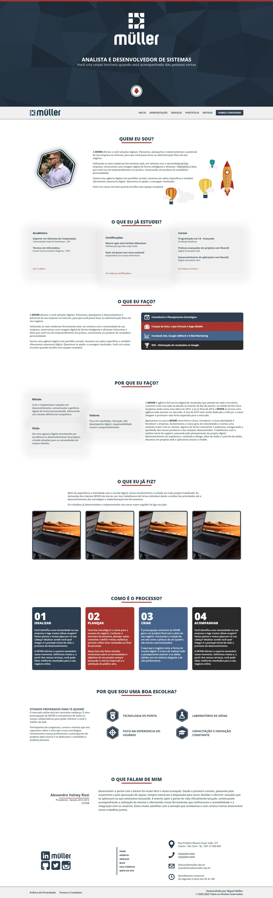

# **Website - Miguel Muller - Personal Website**

<table>
 <tr>
  <td><a href="README-en.md"><strong>README.md - English</strong></a></td>
  <td><a href="../README.md"><strong>README.md - Portuguese</strong></a></td>
 </tr>
</table>

## :pushpin: **Introduction**

In 2013, when I started developing as a freelancer, I created a personal agency and named it "Devim." I kept the name Devim to distance myself from my xxx because I couldn't give it the attention it deserved due to other professional commitments.

This project is a revamped version of the website, now under my own name.

The project was built using Next.JS, a React.js framework, and utilizes TypeScript.

This project serves two purposes:
1. To be the repository for my personal website.
2. To act as an experimental lab.

The project is not complete, and it never will be. Just like my vision of software, it meets the needs of now, but the needs of tomorrow may differ.

 

## :file_cabinet: **Content Management**

The project uses Hygraph as the main tool for content management. Hygraph is a powerful content management platform that offers a variety of features and functionalities to facilitate the creation, organization, and publication of content efficiently and intuitively.

**[Admin Content - Hygraph](https://app.hygraph.com/)**

### :arrow_forward: **Hygraph Configuration**

Before running the project, it's necessary to configure the `graphcms.json` file in the settings folder according to the `graphcms.json.exp` template with information from your project on Hygraph.

This information is essential for the project to connect to Hygraph and manage content efficiently.

 

##  :link: **Environments**

This project has two main environments: Production and Development.

- **Production:** The production environment is where the stable site is hosted. You can access it here:

<table>
 <tr>
  <td><a href="https://www.miguelsmuller.dev.br">
    <strong>Live: www.miguelsmuller.dev.br</strong>
  </a></td>
 </tr>
</table>

- **Development:** The development environment contains new features in testing. When commits occur in branches other than the main (master), a staging environment is generated automatically. Links to these staging environments are temporary and will only be available after the push to the parallel branch.

 

## :computer: **Requirements and Installation**
The requirements for running the project locally are simple.

You need to have **[NodeJS](https://nodejs.org/)** and **[NPM](https://www.npmjs.com/)** installed on your computer or in a virtual machine.

`$ node --version && npm --version`

_For reference, NodeJS v18 and NPM v9 were used in development._

Install project **dependencies** with:
`$ npm install`

Run the **Development Environment** with the NPM script:
`$ npm run dev`

 

## :infinity: **Workflow**
**[WORKFLOW.md](WORKFLOW.md)** - This project uses the workflow pattern called `git flow`.
- [Atlassian - Comparing Workflows](https://www.atlassian.com/br/git/tutorials/comparing-workflows/gitflow-workflow)
- [Difference between workflows](https://www.zup.com.br/blog/git-workflow)
- [Gitflow Cheatsheet](https://danielkummer.github.io/git-flow-cheatsheet/index.pt_BR.html)

 

## :1st_place_medal: **Tests**
[To be implemented]

 

**[GITHUB ACTIONS](https://github.com/miguelsmuller/site-miguelsmuller/actions)** - This project utilizes two GitHub Actions workflows for deployment:

- **Deploy to Live ([firebase-hosting-master.yml](./.github/workflows/firebase-hosting-master.yml)):** This workflow is automatically triggered on commits to the main branch (master) and is responsible for deploying the stable version of the site to the production environment.
  - You can track the progress of this workflow [here](https://github.com/miguelsmuller/site-miguelsmuller/actions/workflows/firebase-hosting-master.yml).

- **Deploy to Preview ([firebase-hosting-channel.yml](./.github/workflows/firebase-hosting-channel.yml)):** This workflow is automatically triggered on commits to branches other than the main (master) and is responsible for creating a preview environment to test new features. Links to these preview environments are generated randomly and temporarily.
  - You can track the progress of this workflow [here](https://github.com/miguelsmuller/site-miguelsmuller/actions/workflows/firebase-hosting-channel.yml).

### :fire: **Firebase Functions**

This project uses Firebase Functions for hosting, and the `server.js` file at the root of the project is the entry point for Firebase Functions. The main method, `nextjsServer`, is responsible for starting the Next.js server.

### Package.json Configuration

Certifique-se de que o arquivo `package.json` está configurado corretamente, apontando para o arquivo `server.js` como o ponto de entrada principal das funções Firebase.

 

## :hammer_and_wrench: **Contributing**
**[CONTRIBUTING.md](CONTRIBUTING.md)** - Specifications of how the contribution should be submitted

 

## :memo: **Changelog**
**[CHANGELOG.md](CHANGELOG.md)** - Chronologically list of changes for each version of a project

 

## :framed_picture: **Screenshot**

